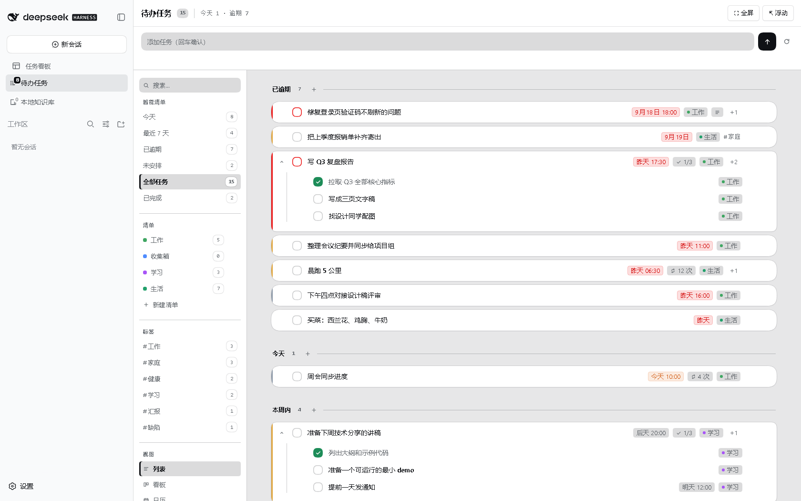
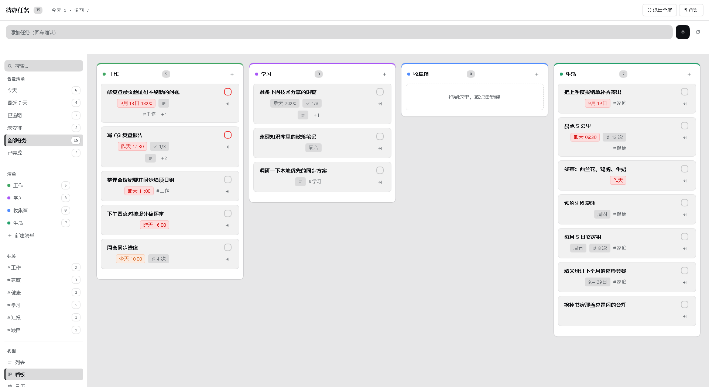
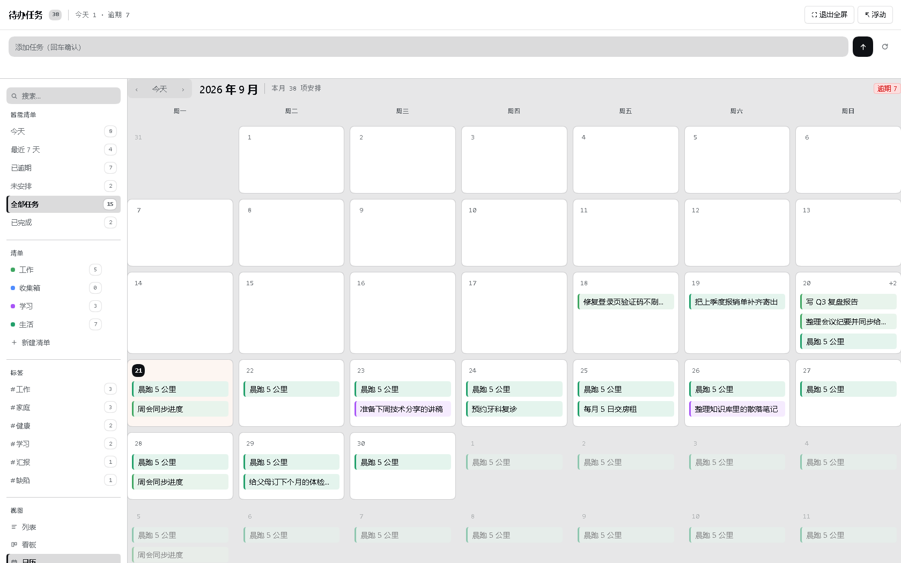
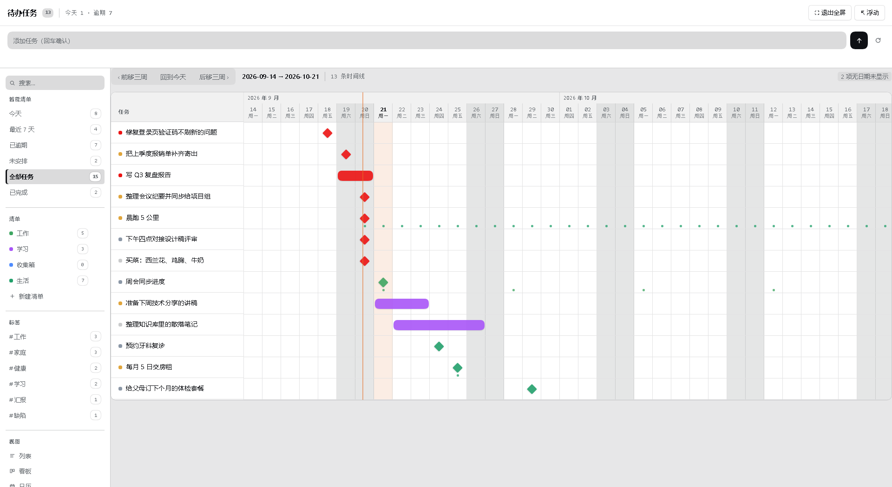
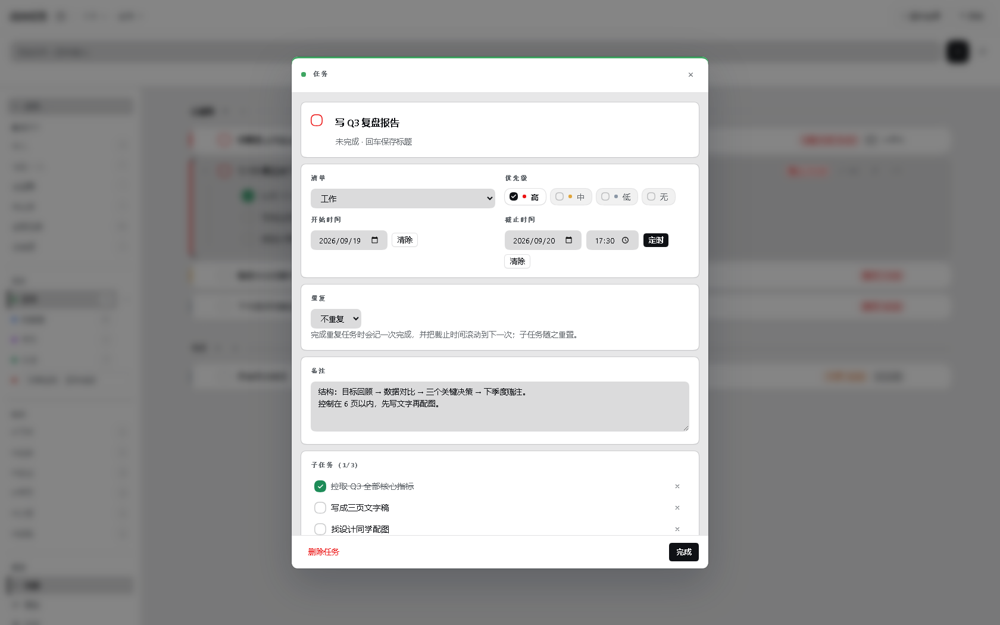
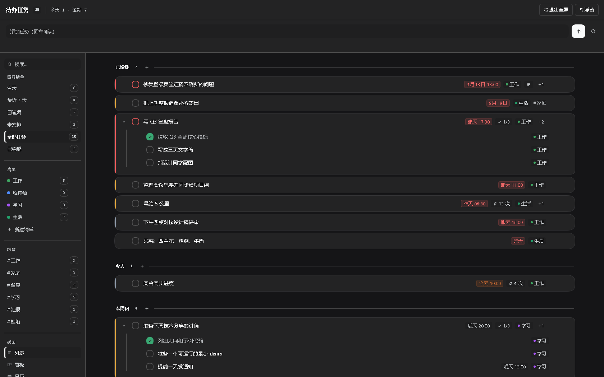
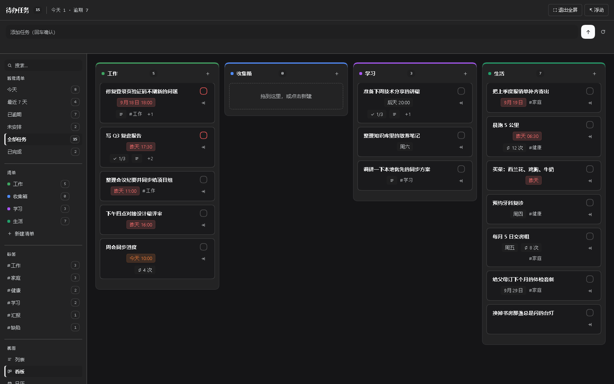
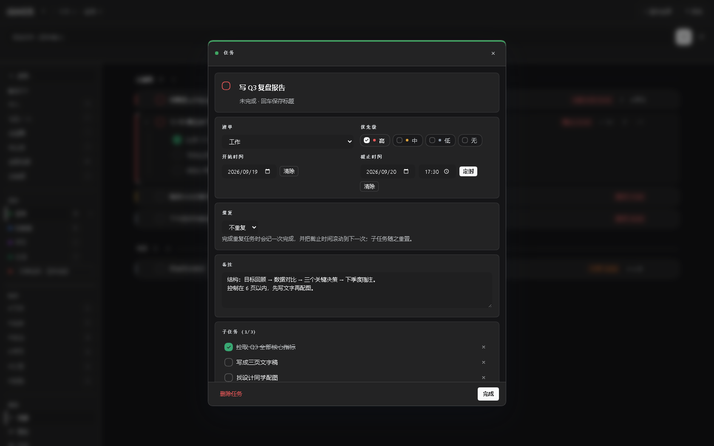

<h1 align="center">dsh-task-todo · 待办任务</h1>

<p align="center">在 DSH 里管理你的任务：四种视图、子任务与备注、每日/每周/每月重复，<br>
并且同一份数据对 agent 开放为工具与斜杠命令。</p>

<p align="center">
  <a href="./LICENSE"></a>
  <a href="https://github.com/deepseek-ai/deepseek-harness"></a>
  
</p>

---

## 它做什么

侧边栏在「新建会话」和「工作区」之间多出一个「待办任务」入口，点开即用主面板里的完整任务页；
再点一次同一个入口就收起、回到会话。同一份数据也是 agent 可读写的工具集。任务是全局的
（不是按会话分库），所以你早上加的任务，下午在另一个会话里依然在。

| 能力 | 说明 |
| --- | --- |
| 四种视图 | 列表（按 逾期/今天/明天/本周/以后/未安排 分组）、看板（列 = 清单，可拖拽换清单）、日历（月网格，重复任务出现在每个发生日）、甘特图（`start` → `due` 区间，可前后翻页）。切换器在左侧栏的「视图」分组里，窄宽度下自动搬到顶栏 |
| 任务详情 | 点任意任务/子任务从屏幕正中弹出卡片（Esc、点遮罩、点 ✕ 都能关），面板和全屏用的是同一个弹窗 |
| 子任务 | 任意层级，可折叠；每个子任务有自己的备注、优先级、截止时间 |
| 备注 | 任务与子任务都能写多行备注（列表里以图标标记，鼠标悬停看内容） |
| 重复 | 每天 / 每周（可指定周几）/ 每月，支持间隔（每 2 周）、结束条件（到某天 / 共 N 次）；完成一次会滚动到下一次并重置子任务 |
| 快速添加 | 一句话搞定：`明天 15:00 交周报 !高 #工作 @紧要`；输入框下方**实时显示这次回车会创建什么**（标题、截止、重复、优先级、标签、清单，清单不存在时会说明将自动创建）——识别结果来自宿主自己的解析器，所见即所得 |
| 标签 | 左栏「标签」分组列出所有用过的标签与未完成计数，点一下只看该标签；搜索框输入 `#工作` 是同一件事。标签可整体改名（改一次，所有任务跟着变）或清空 |
| 智能清单 | 今天 / 最近 7 天 / 已逾期 / 未安排 / 全部 / 已完成，带实时计数 |
| 清单管理 | 左栏每行一个清单：点齿轮（或选中该行后点）打开居中弹窗，可**改名 / 换颜色 / 上移下移 / 删除**；也能直接拖拽换位置。颜色是 8 个预设色，点一下即生效——不提供取色器，因为它把"记一件事"变成"配一套品牌色" |
| 新建清单 | 左栏「清单」分组里直接输入名字回车即建，输入框前的圆点就是它将要得到的颜色（宿主决定的，不是猜的） |
| 数据与备份 | 左侧栏「数据」分组写明数据文件叫什么、在哪儿，并给出一键 导出备份 / 导入恢复 / 复制路径 |
| 全屏 | 覆盖整个框架的全屏模式（Esc 退出，再点入口也可收起），切换不丢当前视图与筛选 |
| 侧边栏徽标 | 入口图标右上角显示待办数（口径可在设置里切换：今天 / 逾期 / 未完成） |
| 与 agent 协作 | 6 个工具 + `/todo` 斜杠命令 + 随包分发的技能，天然可对话操作 |

界面按 [Beautiful UI](https://tycoding.github.io/beautiful-ui-vue/) 的语言重做：发丝级描边代替粗边框、
等宽数字对齐计数、胶囊行、状态色胶囊、45° 虚线分组、悬停浮起与展开动画；颜色仍然全部由 DSH 主题令牌
`color-mix` 推出，所以明暗两套主题共用一份样式。


### 界面



| 看板（列 = 清单，顶边是清单色） | 日历（月网格，胶囊按清单着色） |
| --- | --- |
|  |  |

| 甘特图（月份色带 + 今天列 + 周末底色） | 任务详情（屏幕正中的弹窗） |
| --- | --- |
|  |  |

深色主题走的是同一套令牌，没有第二套配色：

| 全屏列表 | 看板 | 任务详情 |
| --- | --- | --- |
|  |  |  |

> 以上 8 张都是**最终交付版本的实拍**（2026-09-21；浅色 1680 与宽档 1920、深色 1680），
> 不是设计稿。**两处说明**：① 唯一的浮动窗口皮肤与 ≤680px 窄档**没有像素证据**（见「已知边界」）；
> ② 捕获浮层与 `Ctrl+K` 命令面板没有放图——那两张实拍里当时还开着任务弹窗，代表不了这两个浮层自己的样子。

捕获条常驻在每个座位的顶部（上图第一条就是），`Ctrl+Shift+K` 从任何地方唤起同一个输入框，
`Ctrl+K` 打开命令面板——三处的草稿与预览是同一份状态，切换座位不会丢。

界面的三条规则：

- **颜色只表示两件事**：优先级（灰 / 橙 / 红）画在列表与看板卡片的左缘；清单色画在看板列顶边、
  日历胶囊和甘特条——时间视图里横向位置已经表示"什么时候"，颜色就自由地表示"属于哪个清单"。
- **表面层级只有三层**：画布（浅灰）→ 卡片/看板列（白）→ 高亮/选区（更浅的灰）；
  弹窗是框架级覆盖层。
- **前景色永远来自令牌**：DSH 浅色主题的主色是近黑、深色主题里是近白，所以"品牌底 + 白字"
  这类写法会在一半主题下变成隐形（这一条被门禁和暗色截图同时抓到过）。


### 界面结构

```
侧边栏                          主面板（点侧边栏入口打开，再点一次收起）
 ┌ 新建会话 ┐                  ┌ 待办任务 ⑦  今天 3 · 逾期 1          [搜索] [全屏] ┐
 │ ▣ 待办任务③│  ← 这里        ├ 添加任务：明天 15:00 交周报 !高 #工作 @紧要  [➤] [↻] ┤
 ├ 工作区 ──┤                  ├──────────────┬──────────────────────────────────────┤
 │  …       │                  │ 智能清单      │  已逾期 ② ────────────────────────────│
 └──────────┘                  │  今天     3   │  ┃○ 逾期的报告            昨天  #工作  │
                               │  最近7天  5   │  今天 ⑤ ──────────────────────────────│
                               │  已逾期   1   │  ┃▾ ○ 今天的评审  15:00  ✓0/2  ▤  #工作 │
                               │  未安排   2   │  ┃    ○ 准备材料                        │
                               │  全部任务 7   │  ┃    ○ 邀请评审人                      │
                               │  已完成   1   │  ┃○ 每周一晨会   ⟳ 3 次                 │
                               │ 清单          │  未安排 ① ────────────────────────────│
                               │  ● 收集箱  4 ⚙│  ○ 没有日期的想法                       │
                               │  ● 工作    3 ⚙│                                        │
                               │  ＋ ● 新建清单 │                                        │
                               │ 视图          │                                        │
                               │  ☰ 列表       │                                        │
                               │  ▤ 看板       │                                        │
                               │  ▦ 日历       │                                        │
                               │  ⊳ 甘特图     │                                        │
                               │ 数据          │                                        │
                               │  tasks.json   │                                        │
                               │  导出 导入 复制│                                        │
                               └──────────────┴────────────────────────────────────────┘

任务卡片是白色浮起的圆角卡，左缘 3px 色条 = 优先级（灰/橙/红）；
▾ 折叠子任务，子任务嵌在父卡片内；行尾 ＋ / × 悬停时出现。
清单行的 ⚙ 只在悬停/聚焦时出现，以及你当前正筛选的那个清单上——免得左栏变成一排一模一样的点。
```

点任务 → 屏幕正中的详情弹窗（不是右侧抽屉），面板与全屏共用同一个：

```
                    ┌ 任务  ──────────────────────────────── ✕ ┐
                    │ ○  今天的评审                              │
                    │ 清单 工作      优先级  ●高 ○中 ○低 ○无    │
                    │ 开始 2026-02-11 截止 2026-02-11 15:00      │
                    │ 重复 不重复                                │
                    │ 备注 …                                     │
                    │ 子任务 0/2  ＋ 添加子任务                  │
                    │ 标签 #工作 ×                               │
                    ├ 删除任务                             完成 ┤
                    └────────────────────────────────────────────┘
```

弹窗里没有内部 id：能认出任务的是标题，`t_mu5a9xo3` 这种字符串只属于数据文件。
删除、导入这类不可撤销的动作一律走**页面内的确认卡**（居中、可 Esc / 取消），
不用 `window.confirm`——宿主可能直接屏蔽它，"按钮点了没反应"就是这么来的。

清单的齿轮打开同一个壳的窄版弹窗（改名 / 颜色 / 位置 / 内容 / 删除）：

```
              ┌ 清单  ────────────────────────── ✕ ┐
              │ 名称  [ 工作                     ] │
              │ 颜色  ● ● ● ● ● ● ● ●              │
              │ 位置  [↑ 上移] [↓ 下移]  第 2 / 4 位 │
              │ 内容  ● 工作   3 个未完成 · 共 5 个 │
              ├ 删除清单                     完成 ┤
              └────────────────────────────────────┘
```

颜色只有 8 个预设，点一下立即生效：清单色是给人**一眼分辨**的标签，不是设计决策。
换一个取色器省下的那次点击，代价是把"记一件事"变成"配一套品牌色"——这一版做过又撤了。
删除的后果写在确认卡里（"3 个任务（2 个未完成）会移到「收集箱」"），因为删清单**不删任务**。


---

## 安装

前置：已安装 DeepSeek Harness（`dsh`，且 `dsh web` 能跑起来），Node ≥ 22。

```sh
# 从 npm 安装（包发布后可用；当前请先 git clone 再指本地目录）
dsh plugin --profile web add dsh-task-todo

# 或者指到本地目录（开发形态）
dsh plugin --profile web add "<插件目录的绝对路径>"
```

然后**重启 `dsh web`**：bundle 层只在启动时读取。带 UI 的插件还要
`Ctrl+F5` 强刷一次浏览器（客户端 bundle 按包路径缓存）。

卸载：

```sh
dsh plugin --profile web remove dsh-task-todo
```

## 配置

设置 → 插件 → 待办任务：

| 项 | 默认 | 说明 |
| --- | --- | --- |
| 启用 | 开 | 关闭后工具与界面都不工作 |
| 数据文件 | `<DSH_HOME>/todo/tasks.json` | 留空用默认；改动会重新加载 |
| 默认清单 | 收集箱 | 新增任务未指定清单时的归属 |
| 每周起始日 | 周一 | 只影响日历视图的列顺序 |
| 侧边栏徽标 | 今天 | 今天（今天到期 + 逾期）/ 逾期 / 未完成 |

---

## Skills

| Skill | 用途 |
| --- | --- |
| `todo` | 教模型如何用这 6 个工具、日期与重复约定、快速添加语法、以及哪些事不要承诺（例如提醒） |

## MCP servers

无。本插件不依赖外部进程。

## Tools

| 工具 | 参数 | 返回 |
| --- | --- | --- |
| `task_list` | `filter` `list` `query` `includeDone` `includeSubtasks` `today` | 任务列表 + 计数 + 全部清单（含 id/颜色/顺序/任务数）+ 文本摘要 |
| `task_add` | `title` `due` `start` `priority` `list` `tags` `note` `repeat` `repeatInterval` `repeatWeekdays` `repeatUntil` `repeatCount` `parent` | 新任务 |
| `task_update` | `id`(或唯一标题) + 任意可改字段 | 更新后的任务 |
| `task_done` | `id` `undone` | 任务（重复任务会滚动到下一次） |
| `task_delete` | `id` | 被删除的 id（含子任务） |
| `list_manage` | `action`(list/create/update/move/delete) `id`(或唯一清单名) `name` `newName` `color` `index` `delta` | 清单（或清单列表）+ 文本摘要 |

`id` 也接受唯一标题；标题不唯一时会拒绝并返回候选，不会替你猜。清单同理：`list_manage`
接受唯一的清单名，删除只删分组、任务移到「收集箱」，系统清单「收集箱」删不掉。

## 斜杠命令

| 命令 | 行为 |
| --- | --- |
| `/todo` | 今天的概览 |
| `/todo add <文本>` | 快速添加 |
| `/todo ls [今天\|本周\|逾期\|未安排\|全部\|已完成]` | 列出任务 |
| `/todo done <id\|标题>` | 完成 |
| `/todo help` | 语法速查 |

---

## 开发

```sh
node scripts/check-ready.mjs      # 全部门禁 + 安装就绪检查
```

| 脚本 | 覆盖 |
| --- | --- |
| `scripts/audit-shape.mjs` | 形态一致性：bundle 与动态插件 API 不混用、严格注入、纯 JS、服务方法对账 |
| `scripts/audit-css.mjs` | 样式覆盖：JSX 里出现的每个 class 都至少有一条规则（含动态拼出来的）；弹窗是居中 fixed 层；旧的右侧抽屉不再存在；配色只有一套别名、没有绕过它的字面色 |
| `scripts/test-recurrence.mjs` | 日期与重复引擎（锚点、月末、周几、结束条件） |
| `scripts/test-store.mjs` | 数据模型、快速添加解析、筛选、分组、四种视图载荷 |
| `scripts/test-import-markdown.mjs` | 旧待办迁移：字段映射、子任务、时区换算、重复导入幂等、`--dry-run` 不落盘 |
| `scripts/test-json-gate.mjs` | 用真实校验器跑遍每个工具 / HTTP 方法 / 命令出口，含错误路径 |
| `scripts/verify-client-render.mjs` | 真实宿主 + 真实 HTTP + 真实 `createElement`，渲染并驱动四种视图、居中弹窗、页面内确认卡、拖拽、全屏、搜索、侧边栏入口的二次点击、清单弹窗的改名/换色/上移下移/拖拽排序/删除确认 |
| `scripts/smoke-live.mjs` | 对着**正在运行**的 `dsh web` 打真实 HTTP（`node scripts/smoke-live.mjs [--base URL]`），自建自清；没有实例时跳过 |
| `scripts/import-markdown-todos.mjs` | 迁移工具（不是门禁）：把"一个任务一个 `.md`"的旧导出导进来，详见下面的「从旧待办迁移」 |

改 UI 时先跑门禁、再截图：门禁保证结构（class 都有规则、没有第二套配色、接口没退化），
截图保证观感——两者都过才算改完。当前基线：`audit-shape 76 / audit-css 13 / recurrence 70 /
store 146 / import 35 / json-gate 127 / client-render 197`。

样式改动的验证不止门禁，还有**真实截图**（README 里的图就是这么来的）：

```sh
node scripts/demo-seed.mjs                     # 造一个隔离的 DSH_HOME + 演示数据
$env:DSH_HOME="…\scripts\.shot\home"; dsh --profile web --port 4188 --no-open
node scripts/shot.mjs --url auto               # 逐个视图 + 清单弹窗截图（CDP，无额外依赖）
node scripts/shot.mjs --url auto --only 03-full-board --eval "getComputedStyle(document.querySelector('.td-card')).backgroundColor"
```

> 在某些受限环境里（例如把 DSH 装在需要额外权限的沙箱里），无头 Chrome 的 DevTools socket
> 会连得上却**不回命令**，`shot.mjs` 就会一直等下去。这时以门禁为准，并在真浏览器里手点一遍
> 受影响的界面；不要把"截图跑不动"当成"界面没问题"。

`shot.mjs` 用 Node 22 自带的 `WebSocket` 直连 CDP，不装 puppeteer；`--eval` 用来量真实的
几何与计算样式（"这个卡片到底多宽、文字到底是什么颜色"），比对着 PNG 猜可靠。
`demo-seed.mjs` 会把演示数据写进 `scripts/.shot/home`（已 gitignore），**不碰你的真实数据**。

数据默认落在 `<DSH_HOME>/todo/tasks.json`，写入是原子的（`.tmp` + rename）；文件损坏时会备份成
`tasks.json.corrupt-<时间戳>` 并在界面上提示，不会静默丢数据。

**备份与恢复**：左侧栏「数据」里可以直接 导出备份（下载一份完整 JSON）/ 导入恢复 /
复制路径。导入会用备份文件整体替换当前数据，被替换前的那份会先落成
`tasks.json.before-import-<时间戳>`——`applyDocument` 会规整数据、丢掉认不出的字段，
所以这一步必须留退路。

## 从旧待办迁移

`scripts/import-markdown-todos.mjs` 吃"一个任务一个 `.md`"的导出格式（YAML frontmatter
+ `# 标题` + 正文），把老记录映射进来：

```sh
node scripts/import-markdown-todos.mjs --from "C:\…\待办" --projects "C:\…\项目" --dry-run
node scripts/import-markdown-todos.mjs --from "C:\…\待办" --projects "C:\…\项目" --push http://127.0.0.1:43129
```

| 老字段 | 变成什么 | 为什么 |
| --- | --- | --- |
| `project_id` | 清单（同名复用；颜色取最接近的预设色） | 老系统里项目就是分组，和清单同构 |
| `status: done` | 完成状态 + `completed_at`（换算成本地时间） | 这是状态，不是分组；「已完成」智能清单负责展示 |
| `status: doing` / `block` / `workflow` | 标签 `#进行中` / `#受阻` / `#流程中` | 本插件没有第三种状态，标签能跟着任务走 |
| `priority` | high/mid/low → 3/2/1 | |
| `repeat` | 真实的重复规则 | 没有截止时间的重复任务用导入当天做系列锚点 |
| `remind` | 备注里的一行 | v1 不做提醒，但也不该把信息丢掉 |
| `tags` / `subtasks` | 标签 / 子任务（含完成状态） | 子任务沿用父任务的创建时间，完成时间留空而不是填"现在" |
| `id` | **原样保留** | 重跑幂等，且每条任务都能追回源文件 |

安全性：动手前先把原文件复制成 `tasks.json.before-import-<时间戳>`，`--dry-run` 打印
全部计划且不写盘，重复运行只跳过。`--push` 是给"App 正在运行"这种情况准备的：运行中的
`dsh web` 会把整份文档缓存在内存里，直接改文件的话，用户在界面上的第一次勾选就会把导入
覆盖掉——`--push` 把合并后的文档交给那个实例自己的导入接口，两边就一致了。

## 已知边界

- **不做提醒 / 系统通知**（v1）：到点弹窗需要宿主侧定时器与通知通道，属独立改动。
- **列表键盘导航未经有效验证**（不是"不可用"，也不是"部分可用/待优化"）。唯一一次真按键对照被测试配方污染
  （配方从头到尾开着任务编辑器，键盘链按设计拒绝动光标），另外**两个确证缺陷**尚未修：
  ① 编辑器所编辑的任务被删掉后 `openId` 仍非空，会**静默吃掉列表键盘**（`client.js:4308`）；
  ② `focusId` 指向"本帧不渲染的行"（被筛选掉 / 在折叠父级里 / 任务已删）时，容器退位为 `-1`
  而没有任何行补 `0` → 该状态**0 个 Tab 停靠点**（`client.js:2265` + `:2197`）。
- **仓库不变式类检查尚未被独立复核**：单一解析器、不用 `window.confirm`/`prompt`、工具与 HTTP 出口的
  无损 JSON 契约、令牌纪律——这四条**没有**被独立评审过；7 项门禁全绿**只说明门禁检查过的部分是对的**，
  不等于这四条已核。
- 写入是**合并落盘**的：连续勾选十次只写一次盘（约 200ms 合并窗口），插件卸载与导入导出会强制 flush；因此「刚勾完就拔电」这类极端时序下，最后一次改动可能没落盘。
- 标签改名走 HTTP 的 `renameTag`，没有对应工具：agent 需要逐条 `task_update`（界面里改一次即可）。
- 导入备份是整体替换，不做逐条合并。
- 没有文件锁：多个 DSH 进程同时写同一份数据时，后写的会覆盖先写的。个人单机使用无碍。
- 甘特图只画有 `start` 或 `due` 的任务；两者都没有的任务会被计入"未显示"提示。
- **两处证据缺口**（不构成功能缺陷，但别当成已验证）：≤680px 窄档只有断言验证、**没有像素**
  （宿主在 ~1000px 以下收起侧栏、入口点不到）；浮窗自身皮肤同样没有像素。
  深色下有一处**确实变差**：输入框 hover 对比由 1.182 降到 1.055（根因是宿主深色亮带只有 1.161 宽）。

## 安装与重启

`node scripts/check-ready.mjs` 只**打印**安装提示，不会替你装、也不会重启任何 `dsh web`：
安装插件、重启宿主属于你的操作。

## License

[MIT](./LICENSE)
